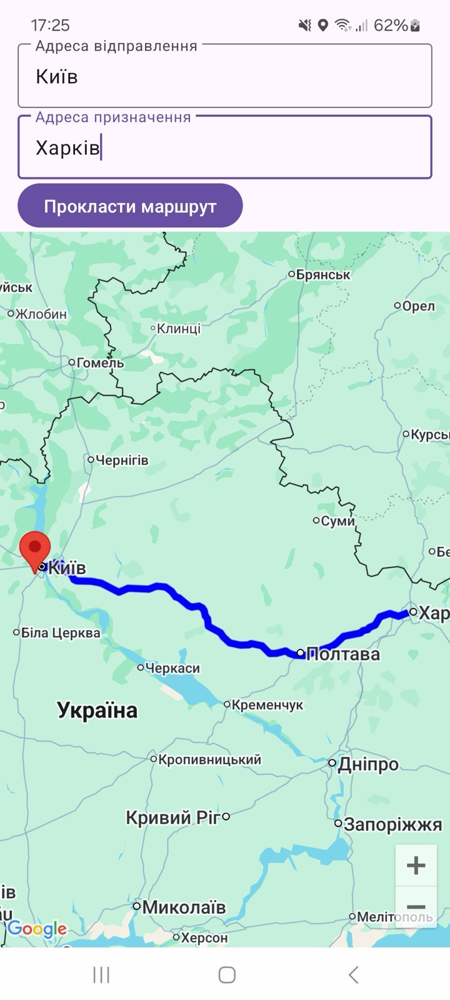

## Description

Application draws route according to entered locations and displays positions passed by user.

## Main components

RoutesApi. The main function of this service is to make a POST request to Google Routes API to get routes between two locations.

LocationService. This service emits current user location.

TrackerFragment. Display map with route and user positions.

## Screenshots

